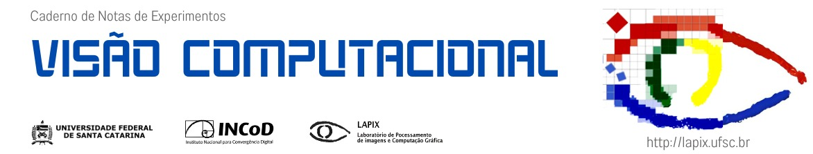

# Visão Computacional: Problemas de Detecção e Reconhecimento de Faces

## Informações

Autores:
- Israel Efraim de Oliveira (israolive.cs@outlook.com);
- Caio César Sabino Soares;
- Gilberto Perez da Silva Junior;
- Lucas Beiler;

**Versão do Python**: 3.11.10  
**Dependências**: requirements.txt

## Arquivos

- Notebook: report.ipynb
- Relatório: report.pdf
- Pesos da rede YOLOv8s treinada: https://drive.google.com/drive/folders/1KTyoKtiSxymysENfpmB1h2m3afDSRydW?usp=sharing
